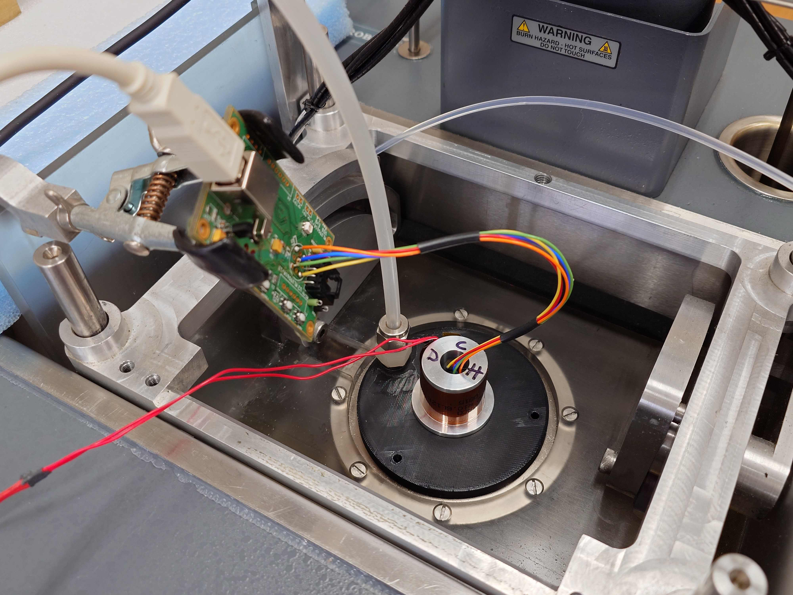

# drop_ir_cal

This project is an analysis/characterization of the Melexis MLX90614 (versions DCH, BCF, DCI) IR sensors for integration into the NCAR NRD41 dropsonde for measuring Sea Surface Temperature (SST). Of primary interest is to understand how well the sensors compensate for thermal gradients.

## Versions

| PART NUMBER | Temperature Code | Voltage | Thermopiles | FOV |
|---------------|---------------|---------------|---------------|---------------|
| MLX90614ESF-DCH-000-SP | E (-40°C...80°C) | D (3V medical accuracy) | C (gradient compensated) | H (12°, refractive lens) |
| MLX90614ESF-BCF-000-SP | E (-40°C...80°C) | B (3V) | C (gradient compensated) | F (10°) |
| MLX90614ESF-DCI-000-SP | E (-40°C...80°C) | D (3V medical accuracy) | C (gradient compensated) | I (5°) |

## Methods

### Setup

Where: NCAR/EOL Calibration Lab

What: Fluke 7040 Oil Bath, Fluke 1594A Super-thermometer/5699 SPRT probe

1.  Insert Blackbody (without radiometer section) into the Fluke 7040 oil bath. Ensure oil level is adequate.
2.  DFS has built an adapter plate and 3 IR sensor jigs to accommodate the three types of IR sensors to be tested. Install the adapter plate and jig to be used (friction fit).
3.  Wrap a heater coil around the jig and tape with Kapton tape. Connect to power supply (\~12V).
4.  Install the SPRT in a stand and lower it into the oil bath. Connect to lab PC and log with RealTerm.
5.  Setup the USB relay valve system between the building air and the adapter plate. Connect to lab PC.
6.  Setup the Melexis evaluation board. Connect to lab PC and log data with Melexis software.

### Oil bath control

The oil bath is set to 25°C to limit the influence of the ambient room temperature.

To keep the oil temperature stable:

1.  Set the temperature to 25°C.
2.  Set heating to low.
3.  Turn on cooling.
4.  Set cooling to low.
5.  Allow the oil bath to run until the display stabilizes at 25.00.

### Data runs

Once the bath temperature and SPRT have stabilized, data can be collected.

All data collected should be based on the lab PC time. The superthermometer has an internal clock that is off slightly.

Capture data for \~1 minute. Then, raise the temperature of the IR sensor body by \~4°C (Ta). Then allow To to return to the initial reading it had. Next, open the relay valve to blow air (low-pressure) past the lens. After this, capture data for another \~30 seconds, before shutting down.

### Data

IR data is saved to PN_SN_YYYYMMDD at 1Hz. SPRT data is saved to ST_YYYYMMDD at 1Hz, different than the default of 0.5Hz. This is done from the 1594A by navigating to Main Menu\>Measure Menu\>Timing Settings and selecting the 'Fast' preset. The SPRT collects data for the entire collection period. Then the SPRT data is joined to the IR data files and given the \_j suffix.

## Data Analysis

| Sensor | Variable | Units | Notes                     |
|--------|----------|-------|---------------------------|
| IR     | Ta       | C     | "ambient" (package temp)  |
|        | To       | C     | "object" (IR)             |
|        | To2      | C     | ???                       |
| ST     | T        | C     | reference                 |
| TH     | T1       | C     | need to identify position |
|        | T2       | C     | need to identify position |
|        | T3       | C     | need to identify position |
|        | T4       | C     | need to identify position |
