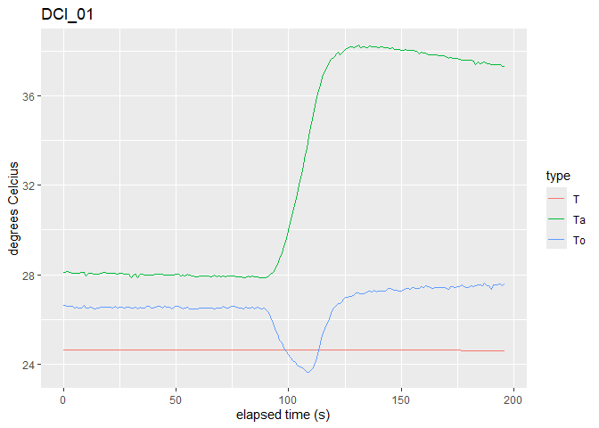

MLX90614 IR Sensor Characterization
================
NCAR/EOL Calibration Laboratory
2025 February 20

# MLX90614

## DCI

``` r
IR_DCI_01 <- read.csv("data/01_DCI_IR_20250220T1045.csv", skip = 2)
colnames(IR_DCI_01) <- c("t", "model", "Ta", "To", "To2", "Tbody", "RAM3", "RAM4", "RAM5")
IR_DCI_01 <- IR_DCI_01 |> 
  select(t, Ta, To, To2) |> 
  distinct(t, .keep_all = TRUE) |> 
  mutate(
    t = as.POSIXct(t, format = "%H:%M:%S"),
    t = as.numeric(difftime(t, min(t), units = "secs"))
  )

ST_DCI_01 <- read.csv("data/01_DCI_ST_20250220T1045", skip =  2)
colnames(ST_DCI_01) <- c("datetime", "T", "3", "4", "5", "6", "7", "8", "9")
ST_DCI_01 <- ST_DCI_01 |> 
   mutate(
     datetime_parsed = as.POSIXct(datetime, format = "%m/%d/%Y %I:%M:%S %p"),
     t = format(datetime_parsed, "%H:%M:%S"),
    .before = 1
  ) |> 
   select(t, T) |> 
  distinct(t, .keep_all = TRUE) |> 
  mutate(
    t = as.POSIXct(t, format = "%H:%M:%S"),
    t = as.numeric(difftime(t, min(t), units = "secs"))
  )

DCI_01 <- inner_join(IR_DCI_01, ST_DCI_01, by = "t")
DCI_01 <- DCI_01 |> 
  relocate(T, .after = t) |> 
  select(t, T, Ta, To) |> 
  pivot_longer(
    cols = !c(t),
    names_to = "type",
    values_to = "C"
  )
```

``` r
ggplot(
  data = DCI_01,
  mapping = aes(x = t, y = C, color = type)) +
  labs(x = "elapsed time (s)", y = "degrees Celcius", title = "DCI_01") +
  geom_line()
```

<!-- -->
